# 戦車のカスタマイズ方法

自身の戦車を開き、Prefabの編集モード内の「戦車Prefab編集モードパネル」で、自身の戦車に砲塔や装甲を付けてカスタマイズできます。

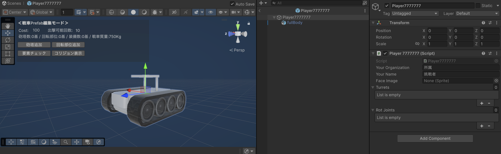

砲塔や装甲の装着には「コスト」がかかり、それらの総コストが１台の戦車を出撃させるのに必要なコスト「**出撃コスト**」となります。  
各プレイヤーは**１試合 1000コスト分 までの戦車を出撃できます。**  
つまり、出撃コストが200の場合、１試合の出撃可能回数は５回となります。  
また、何もつけていない初期状態の場合の出撃コストは100です。

装甲などをたくさんつけると、その分戦車が重くなります。  
戦車が重くなるほど移動速度が遅くなってしまいますが、砲弾を発射したときの反動が小さくなるメリットがあります。 

---

## 砲塔を追加する

「戦車Prefab編集モードパネル」で「砲塔追加」ボタンを押すと、砲塔が追加されます。  
砲塔をつけると、砲弾を発射して他の戦車を攻撃できます。  

砲塔１基のコストは「50」です。  
砲塔は0基でも、複数台つけても構いません。    

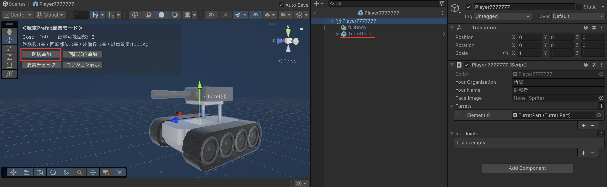

&nbsp;

追加した砲台は、スクリプトのインスペクタの「Turrets」のリストにも追加されます。  
スクリプトで砲台番号を指定する際は、Turretsリストのインデックスを指定してください。

※砲塔のスケールは変更しないでください

---

## 装甲をつける

戦車に好きなモデルの装甲をつけられます。  
コストはモデルの体積によって変動しますが、最小コストは「1」です。

**※あまりにも大きなサイズのモデルの使用はご遠慮ください**  
**※SkinnedMeshRendererは装甲として計上されませんので、MeshRendererを使用してください**  
**※装甲はPrefabの直下（子）に配置してください**

&nbsp;

Prefab内でCubeを作成し、Transform（座標・回転・スケール）を調整するだけでも、装甲の出来上がりです。  

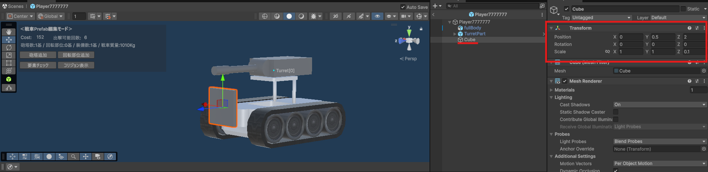

&nbsp;

装甲にテクスチャを貼り付ければ、戦車が更にカッコよく見えます。  

1. 好きなテクスチャをインポートする
2. 新規マテリアルを作成する
3. マテリアルのインスペクタの「Base Map」に、インポートしたテクスチャをアタッチ
4. Prefab内のCubeオブジェクトに、作成したマテリアルをアタッチ

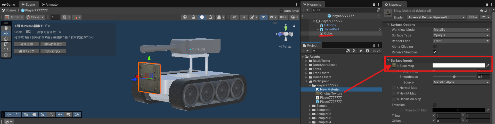

&nbsp;

`Assets/BattleTanks/Prefabs/SampleTank/PartsModel/`  
また、上記のフォルダ内に、弊社がいくつかモデルを用意していますので、ご自由にご利用ください。  
スケールを変更しても構いません。

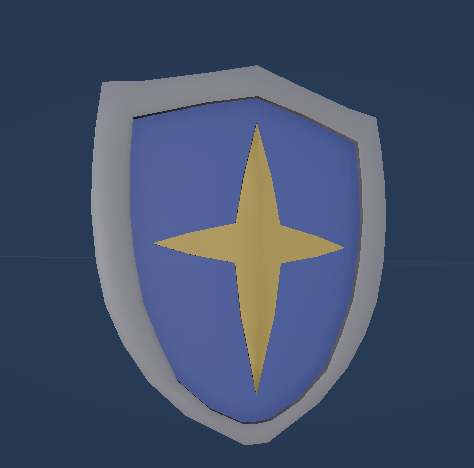

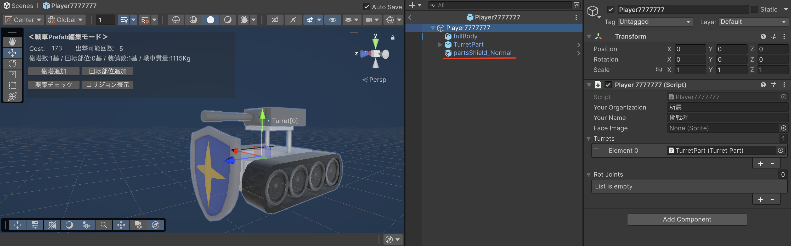

**【2025/10/17追加】**  
モデルの体積によって計算されたコストよりも大きいColliderをつけられてしまうことは想定外だったため、ゲーム中では **MeshRendererの形状に沿ったMeshColliderを動的に生成** するようにしました。  
何かしらColliderがついているMeshRendererに対して、既存Colliderを削除してMeshRendererに差し替える処理になっているので、Prefabの装甲パーツにColliderはつけておいてください。  

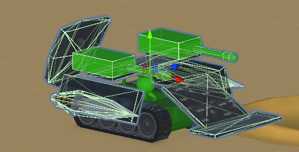

---

## 回転部位を追加する

「戦車Prefab編集モードパネル」で「回転部位追加」ボタンを押すと、回転部位が追加されます。  
回転部位をつけて回転させることで、子にした装甲も一緒に回転させることができます。

回転部位１基のコストは「2」です。  
回転部位は0基でも、複数つけても構いません。

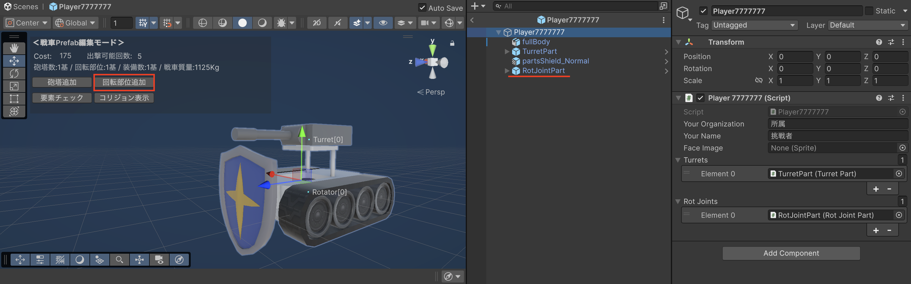

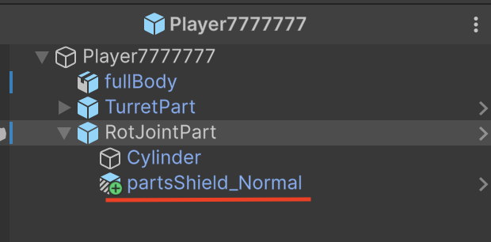

&nbsp;

追加した回転部位は、スクリプトのインスペクタの「RotJoints」のリストにも追加されます。  
スクリプトで回転部位の番号を指定する際は、RotJointsリストのインデックスを指定してください。

---

## 攻撃が当たる部分のコリジョン表示

「戦車Prefab編集モードパネル」で「コリジョン表示」ボタンを押すと、砲弾による攻撃が当たる部分のコリジョンの表示/非表示を切り替えられます。  
半透明の緑色で表示されます。  

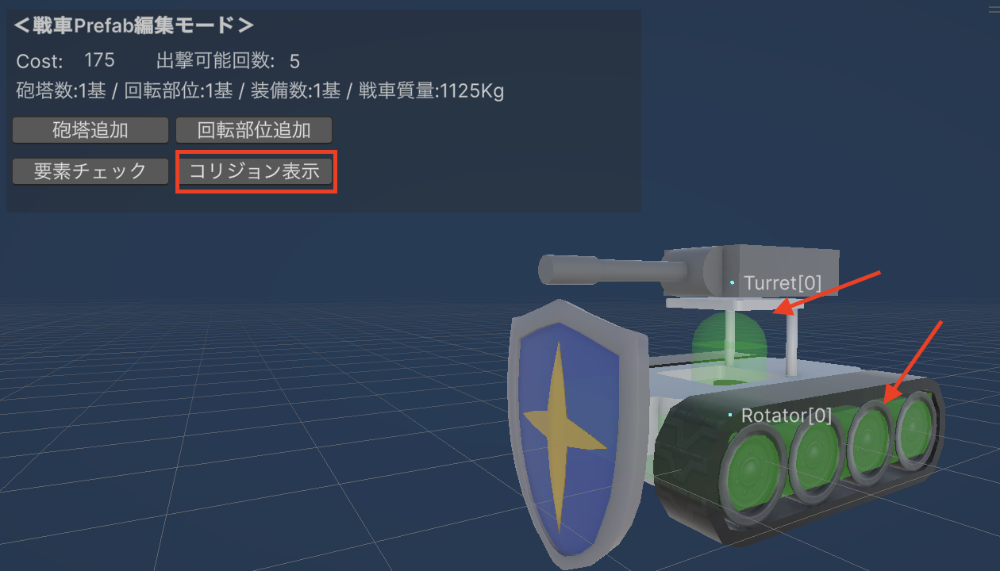

&nbsp;

ボタンを押してもコリジョンが表示されない場合は、エディタ上のこのボタンが有効になっているか確認してください。

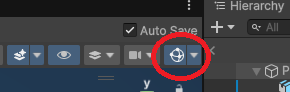

---

## 【2025/10/10追加】 砲塔・装甲・回転パーツを付けられる範囲制限

砲塔・装甲・回転パーツを付けられる範囲に制限をかけるようにしました。  
戦車Prefab編集モードで表示されている白い枠が制限範囲です。  
各パーツのオブジェクトの、MeshRendererが範囲以内におさまるように配置してください。

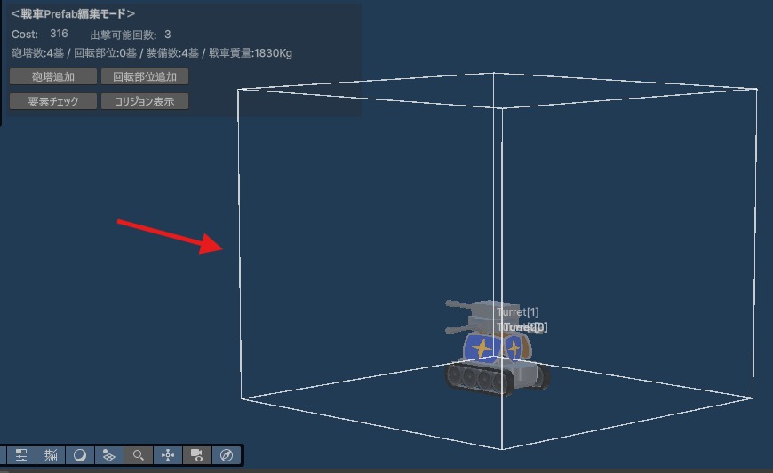

パーツが制限範囲外に出てしまった場合、Prefab編集モード上にエラー文を表示します。  
違反したオブジェクトの名前を表示します。  

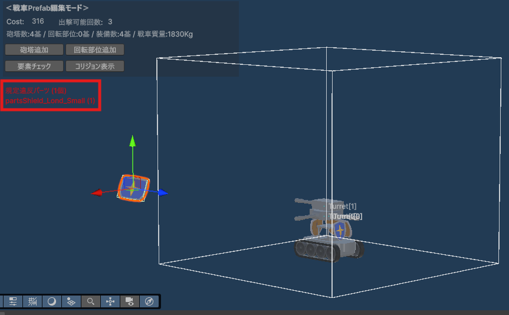

違反したオブジェクトをPrefab内に残したままゲームを再生すると、違反したオブジェクトは削除された状態で試合が始まります。  
違反したオブジェクトを残したままでも試合に影響はありませんが、**違反したオブジェクトのコストも計算されている**ので、削除するか範囲内におさめるようにしたほうがよいでしょう。

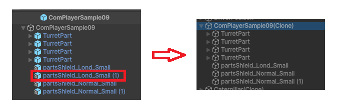

