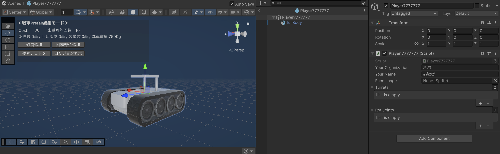
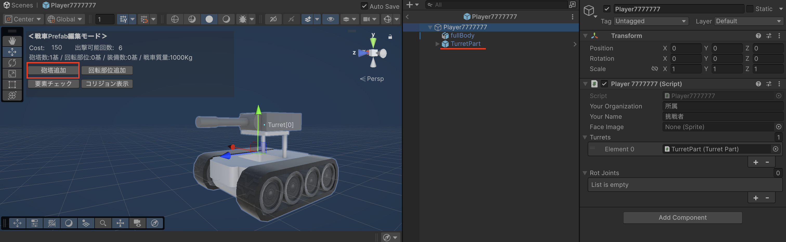
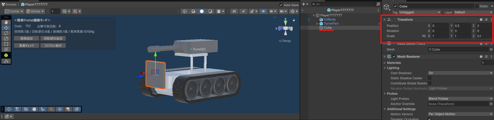
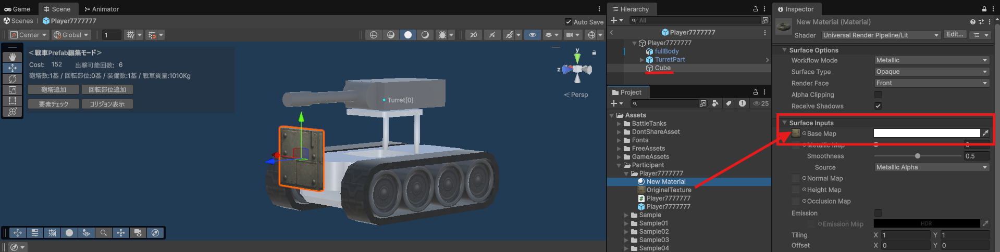
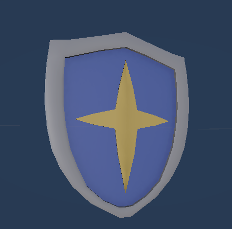
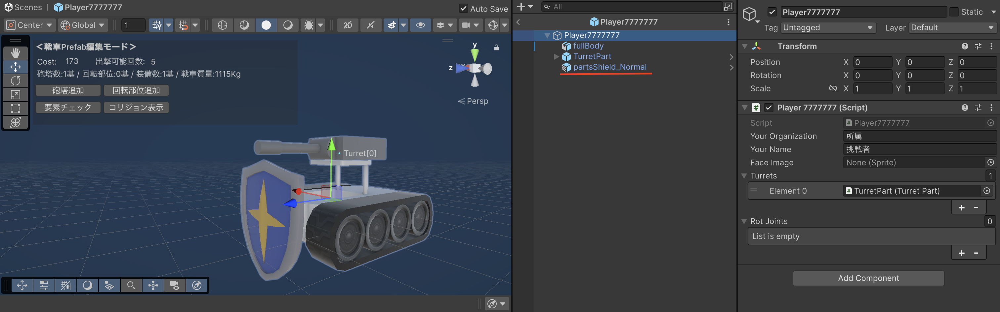
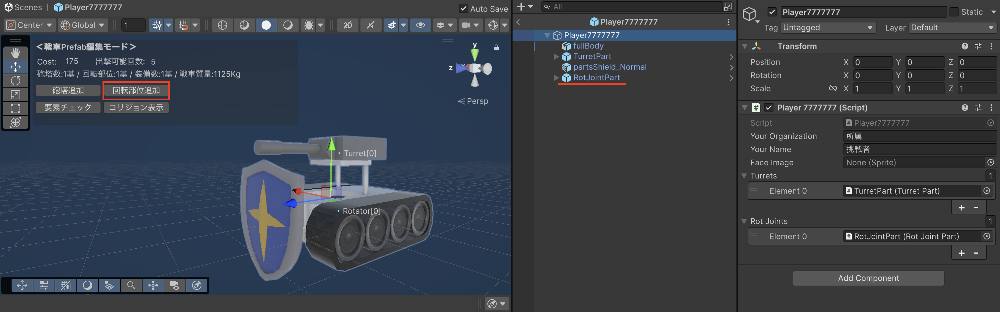
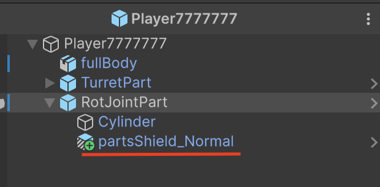
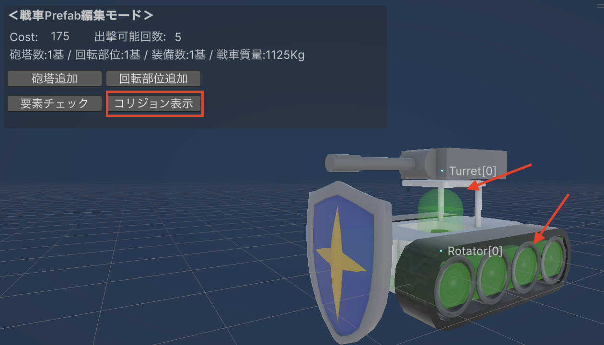
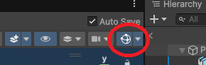

# 戦車のカスタマイズ方法

自身の戦車を開き、Prefabの編集モード内の「戦車Prefab編集モードパネル」で、自身の戦車に砲塔や装甲を着けてカスタマイズできます。

砲塔や装甲の装着には「コスト」がかかり、それらの総コストが１台の戦車を出撃させるのに必要なコスト「**出撃コスト**」となります。  
各プレイヤーは**１試合 1000コスト分 までの戦車を出撃できます。**  
つまり、出撃コストが200の場合、１試合の出撃可能回数は５回となります。  
また、何もつけていない初期状態の場合の出撃コストは100です。

装甲などをたくさんつけると、その分戦車が重くなります。  
戦車が重くなるほど移動速度が遅くなってしまいますが、砲弾を発射したときの反動が小さくなるメリットがあります。 

---

## 砲塔を追加する

「戦車Prefab編集モードパネル」で「砲塔追加」ボタンを押すと、砲塔が追加されます。  
砲塔をつけると、砲弾を発射して他の戦車を攻撃できます。  

砲塔１基のコストは「50」です。  
砲塔は0基でも、複数台つけても構いません。    

&nbsp;

追加した砲台は、スクリプトのインスペクタの「Turrets」のリストにも追加されます。  
スクリプトで砲台番号を指定する際は、Turretsリストのインデックスを指定してください。

※砲塔のスケールは変更しないでください

---

## 装甲をつける

戦車に好きなモデルの装甲をつけられます。  
コストはモデルの体積によって変動しますが、最小コストは「1」です。

**※あまりにも大きなサイズのモデルの使用はご遠慮ください**  
**※SkinnedMeshRendererは装甲として計上されませんので、MeshRendererを使用してください**  
**※装甲はPrefabの直下（子）に配置してください**

&nbsp;

Prefab内でCubeを作成し、Transform（座標・回転・スケール）を調整するだけでも、装甲の出来上がりです。  

&nbsp;

装甲にテクスチャを貼り付ければ、戦車が更にカッコよく見えます。  

1. 好きなテクスチャをインポートする
2. 新規マテリアルを作成する
3. マテリアルのインスペクタの「Base Map」に、インポートしたテクスチャをアタッチ
4. Prefab内のCubeオブジェクトに、作成したマテリアルをアタッチ

&nbsp;

`Assets/BattleTanks/Prefabs/SampleTank/PartsModel/`  
また、上記のフォルダ内に、弊社がいくつかモデルを用意していますので、ご自由にご利用ください。  
スケールを変更しても構いません。

---

## 回転部位を追加する

「戦車Prefab編集モードパネル」で「回転部位追加」ボタンを押すと、回転部位が追加されます。  
回転部位をつけて回転させることで、子にした装甲も一緒に回転させることができます。

回転部位１基のコストは「2」です。  
回転部位は0基でも、複数つけても構いません。

&nbsp;

追加した回転部位は、スクリプトのインスペクタの「RotJoints」のリストにも追加されます。  
スクリプトで回転部位の番号を指定する際は、RotJointsリストのインデックスを指定してください。

---

## 攻撃が当たる部分のコリジョン表示

「戦車Prefab編集モードパネル」で「コリジョン表示」ボタンを押すと、砲弾による攻撃が当たる部分のコリジョンの表示/非表示を切り替えられます。  
半透明の緑色で表示されます。  

&nbsp;

ボタンを押してもコリジョンが表示されない場合は、エディタ上のこのボタンが有効になっているか確認してください。

